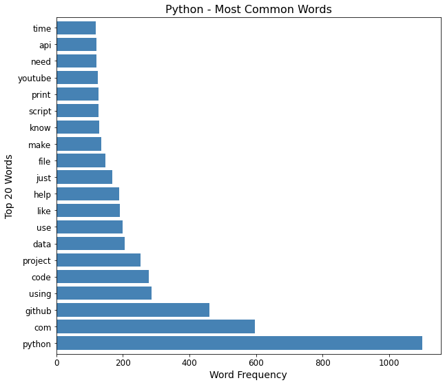
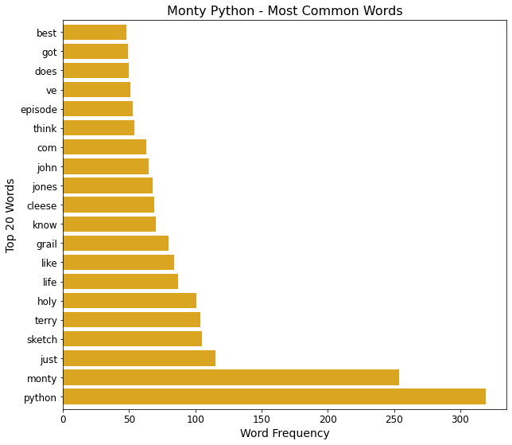
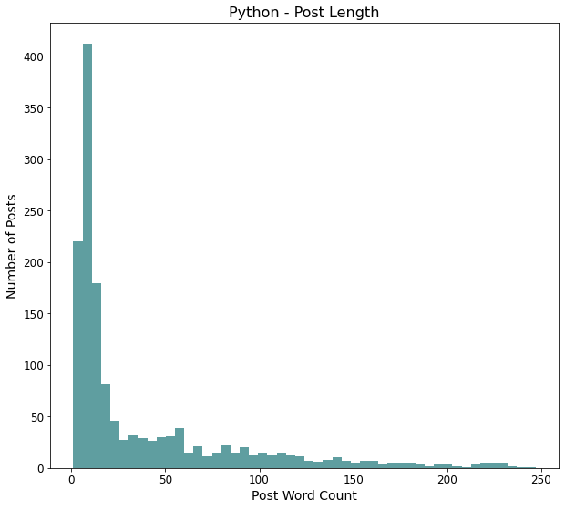
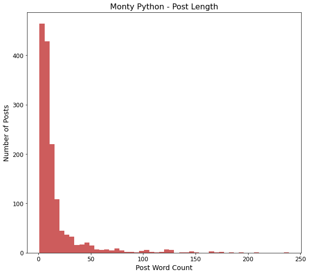
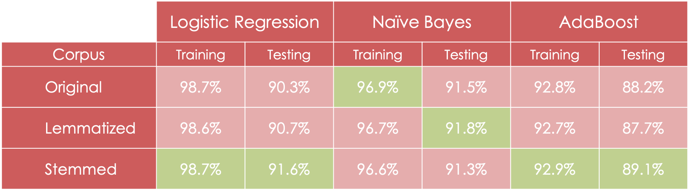
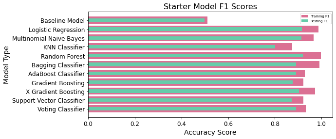
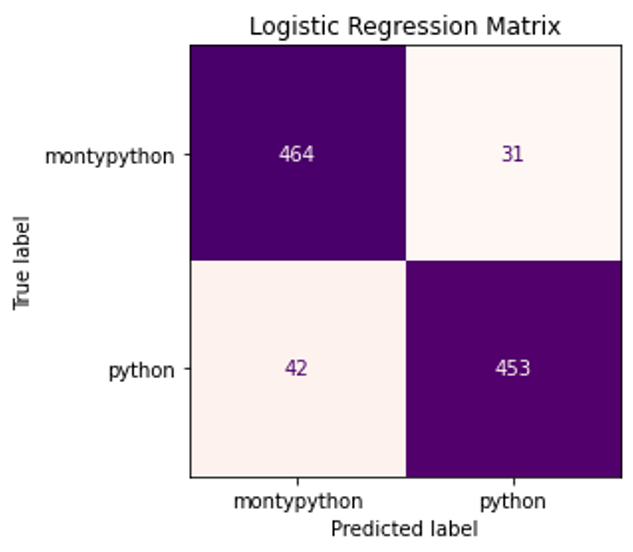
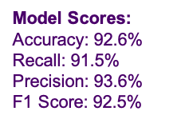
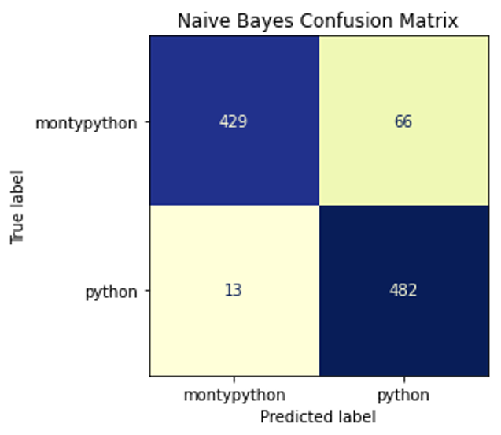
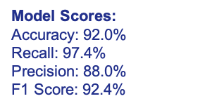

# Optimizing Reddit Advertising
## Enabling One-to-One Marketing via Classification Modeling and NLP

---

## Table of Contents:
- [Introduction](#intro)
    - [The Problem](#problem)
    - [The Proposed Solution](#solution)
- [The Data Science Process](#ds_proc)
    - [Data Collection, EDA & Cleansing](#data_col)
    - [Preprocessing with NLP](#nlp)
    - [Feature Selection](#features)
        - [Data Dictionary](#dict)
    - [Modeling](#modeling)
        - [Battle of the Starter Models](#starter)
        - [Fine Tuning Production Models](#tuning)
    - [Evaluation](#evaluation)
    - [Conclusions & Next Steps](#conclusions) 
- [Repo Structure](#repo)

---
<a id='intro'></a>
## Introduction:
The word "python" means many things to many people. Snake enthusiasts adore their ball pythons with a love that borders on [incomprehensible](https://www.reddit.com/r/ballpython/comments/kbstzv/my_first_snake_i_couldnt_stop_crying/?utm_source=share&utm_medium=web2x&context=3). Fans of screwball British comedy have one holy grail, as it were, the incomparable Monty Python. And while the Python programming language may have been named after the comedy troop, it has gained a reputation in it's own right with fans in the data science world who are as passionate about the programming language as fans of its eponym.
<a id='problem'></a>
#### The Problem:
In the world of Reddit advertising, the proliferation of the word "python" and other data science related terms is a challenge for LabelBox, a company which sells data science products and services. While their display ads on Reddit perform well overall, the LabelBox marketing team has discovered that they inadvertantly display ads on subreddits not related to data science as well, such as ```r/montypython``` and ```r/ballpyton```.  Ad campaigns on these "imposter" python subreddits have very low return on ad spend (ROAS).

However, rather than discontinue ads to these sites entirely, LabelBox wants to get more surgical in their targeting for several reasons:
* Data science and python language subreddits are heavily saturated with ads from LabelBox competitors, so opportunity to scale up advertising in those subreddits is limited. 
* LabelBox has acquired several lucrative clients who saw their ads on one of the "imposter" subreddits when they mistakenly visited in the past.
* Successfully targeting visiters to imposter subreddits who _are_ interested in data science could be a unique and untapped source of new clients for LabelBox.

<a id='solution'></a>
#### The Proposed Solution:
In this project, I will develop and present to the LabelBox technical and marketing teams a classification model that uses natural language processing to identify true positive, true negative, false positive and false negative subreddit posts. False positives, posts on a non-data science subreddit that the model believes should be posted to a data science subreddit, will then be targeted directly by LabelBox via direct message or highly targeted display adds. LabelBox can then discontinue broad, costly batch campaigns in these subreddits, thereby reducing marketing spend while improving marketing metrics such as return on ad spend (ROAS) and cost to acquire (CTA).

My goal is for the model to accurately predict which subreddit a post belongs to 90% of more of the time across my training and testing datasets. 

---
<a id='ds_proc'></a>
## The Data Science Process
<a id='data_col'></a>
### Data Collection, EDA & Cleansing
To develop my classification model, I needed data from Reddit, specifically user submissions from my two target subreddits so I could my model could be training to differentiate between their posts. Using the Pushshift API, requests, json and while loops, I scraped the following data:
* 1500 submissions from ```r/python``` (majority class)
* 1500 submissions from ```r/montypython```

The submissions data contained 77 columns, but the main ones I found to be useful were title, the heading that the user gives their post in Reddit, and selftext, which is the body of the post.

Some submissions contained both a title and selftext, while others only had titles. I combine these into a new column, then dropped all other columns except for id, subreddit, title and selftext. I also created a binary field for subreddit, to help with classification. I filled in null values, then dropped posts with 0 length, of which there were two in the ```r/montypython``` dataset, leaving me with 1500 Python posts, and 1498 Monty Python posts:

<a id='nlp'></a>
### Preprocessing with NLP
Using the title_selftext as the corpus, I performed various NLP processes to prepare the data for modeling:
- Tokenization using CountVectorizer - separates words from the corpus into tokens
- RegularExpressions - to remove punctuation, floating single letters, extra spaces
- Lemmatization using Lemmatizer - returns words their base form
- Stemming using PorterStemmer - truncates variations of words to bring them to their root stem

I also created a post_length column with the count of words for each user post. 

I then looked at the most frequently occurring words in my corpora and found that many were stopwords. After removing English stopwords via CountVectorizer, I created a custom list that included both English stopwords and additions like http, www and amp which were left over from web and search addresses for both subreddits. After removing all stopwords, I compared two characteristics of the Subreddits:

#### Top 20 Most Frequent Words:
17 of the top 20 words in the subreddits are unique, so a bag of words approach to classifying these subreddits should have strong predictive power.  




#### Post Length by Word Count:
Python subreddit has longer posts, with the average at just under 50 words, while posts on the Monty Python subreddit are short and sweet at 17.7 on average. Due to the variance between the subreddits, I will test post_length as a numeric variable in my models. 




<a id='features'></a>
### Feature Selection
After NLP, I have three corpora with different levels of token transformation: the orignal corpus with no modifications, the lemmatized corpus, and the stemmed corpus. To determine which one should be used for modeling, I ran each corpus through three different types of models, then looked at accuracy of training and testing predictions using each corpus. 



**Results:**  Stemmed corpus was the strongest performer in two out of three models (green indicates strongest performing corpus in each model/dataset).

Based on this, my final dataframe for modeling is as follows:

<a id='dict'></a>
#### Data Dictionary
|Feature|Type|Description|
|---|---|---|
|id|str|Unique Reddit user ID
|subreddit|str|Name of subreddit submission scraped from 
|title|str|Title/heading user gave the submission on Reddit
|selftext|str|Body text user wrote in the submission on Reddit
|title_selftext|str|Created variable combining title and selftext columns
|subred|int|Binary indicator: 1 for ```r/Python```, 0 for ```r/montypython```)
|tokens|str|List of individual tokens from the title_selftext column
|post_length|int|Count of words in title_selftext post
|title_selftext_lem|str|Lemmatized form of the title_selftext corpus
|title_selftext_stem|str|Stemmed form of the title_selftext corpus

<a id='modeling'></a>
### Modeling
With the stemmed corpus selected, I approached the process of selecting a classification model to solve my problem statement in two stages:
1) Fit starter models on the stemmed corpus with no adjustments to hyperparameters, to get baseline models. 
2) Select 2 models for tuning and gridsearch over hyperparameters to correct for any issues with accuracy, variance, etc. in the starter model. 

<a id='starter'></a>
#### Battle of the Starter Models
I started by count vectorizing the stemmed corpus, then performed train/test/split, and fit 10 "starter" models. My goal was to eventually end up with at least one model that accurately predicted subreddit on my testing set at 90% or higher. 



Four "starter" models achieved this goal with default parameters. I selected Logistic Regression and Naive Bayes to move forward, since they had the strongest Testing Accuracy, and less variance that the Random Forrest Classifier which had similar results. The final model with >90% accuracy was XGBoost, but it's scores were lower than the other three. 

<a id='tuning'></a>
#### Fine Tuning Production Models
The final stage in the modeling process is to iterate over hyperparameters in my transformers and estimators to achieve the best performing model in terms of accuracy, F1 score and bias/variance tradeoff. 

Techniques and Hyperparameters I considered include:
- GridSearch
- Pipeline
- FeatureUnion
- CountVectorizer
- TFIDFTransformer
- Stop Words
- Max Features
- Min Document Freq.
- Max Document Freq.
- N-Gram Ranges
- Use IDF reweighting
- Normalization
- Solver
- Penalty
- Alpha

<a id='evaluation'></a>
### Evaluation
Each model is has identified posts that were made in the montypython subreddit which, based on the language in the post, the model believes should be in python. These “false positives” (top right of confusion matrix) will become the target audience for one-to-one marketing messages. 








<a id='conclusions'></a>
### Conclusions & Next Steps

#### Model Conclusions
Both Logistic Regression and Naïve Bayes models are performing strongly based on key metrics:
- Accuracy on testing data > 90%
- F1 Scores for testing data ~ 92.5%

Where the models differ is in Precision and Recall:
- Logistic Regression had higher precision, thereby limiting False Positives, and lower recall, which increases False Negatives.
- Naive Bayes had lower precision and higher recall, and the spread between the two scores was wider than for Logistic Regression. 

Because False Positives will become the target audience for one-to-one targeting, marketing objectives will drive final model selection:
- Naïve Bayes = Increase reach, lower ROAS
- Logistic Regression = Reduced reach, higher ROAS

#### Recommendations:
- Perform A/B Testing on False Positives from each model to determine effectiveness and ROAS from each before making final decision.
- Execute A/B testing of marketing tactics to determine ideal one-to-one marketing approach and measure ongoing return on ad spend (ROAS), cost to acquire (CTA) and other relevant performance metrics. 


#### Next Steps:
- Expand scope of model to include additional training subreddits (those relevant to data science, machine learning, python) and additional “imposter” subreddits (where users may mistakenly post data science questions).
- Rerun data science process to ensure models continue to display strong performance and meet objectives for marketing. 
- LabelBox engineering team to productionalize final model(s).

---

<a id='repo'></a>
## Repo Structure:

Reddit Classification Project  
  |- archive
  |- data  
    |- all_py.csv  
    |- all_py2.csv  
  |- code
    |- Project_Python_1_API_EDA.ipynb  
    |- Project_Python_2_Preprocessing.ipynb
    |- Project_Python_3_Modeling.ipynb
  |- images
  |- presentation
    |- DSI_Project3_Reddit_Classification.pdf